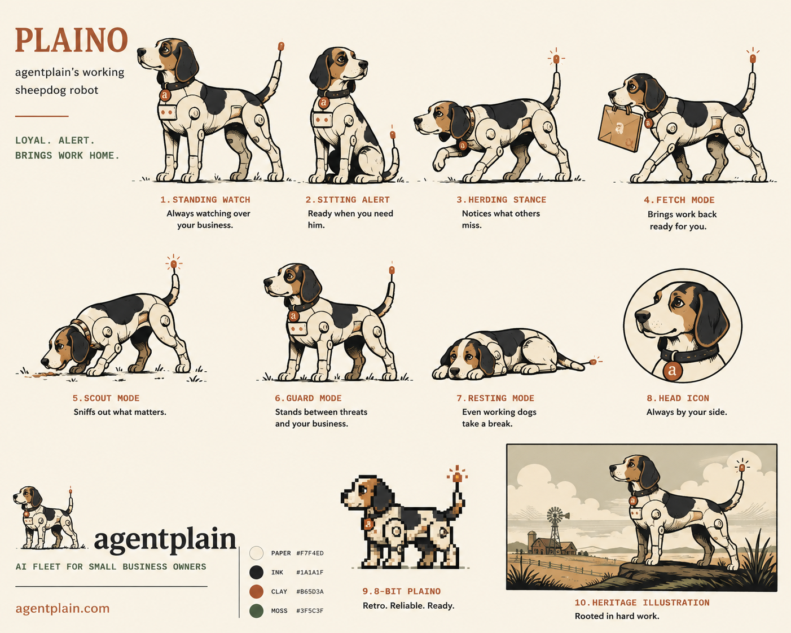

# Plaino brand system

Plaino is agentplain's named service partner — one character across every
workspace. This is the living reference for the Plaino visual system: the
ten illustrated states, where each one renders, and the component API.

> Brand text (name, mission, tagline, positioning) is locked elsewhere —
> see `project_brand_locked` / `project_plaino_named_agent` in memory. This
> doc governs the **visual** mark only.

## The reference sheet

The canonical source of truth is the ChatGPT-delivered reference sheet,
built from `docs/brand` `AGENTPLAIN_BRAND_BRIEF.md`. It is stored at:

`public/brand/plaino-system/reference-sheet.png` (1402×1122)



Every shipped asset is cropped from this sheet by
`tools/brand/crop-plaino-sheet.mjs` (dependency-free — it uses only Node's
`zlib` via `tools/brand/png-lib.mjs`). To regenerate after re-cropping:

```bash
node tools/brand/crop-plaino-sheet.mjs
```

Crop coordinates live at the top of that script. The lesson worth keeping:
**brand-defining illustration came from a clear written brief handed to the
right tool** — not from an agent improvising SVG. New Plaino art follows the
same path (brief → tool/human → sheet → crop script), never freehand.

## The ten states → product wiring

| State | Pose | Renders when… | Surfaces |
|---|---|---|---|
| `standing-watch` | Standing watch | Idle / monitoring, no active work | workspace idle states |
| `sitting-alert` | Sitting alert | Output ready for review / onboarding welcome | onboarding header; approvals (approved) |
| `herding` | Herding stance | Actively running a skill chain | in-flight indicators |
| `fetching` | Fetch mode (clay "a") | Delivering a draft to the approvals queue | **approvals queue card (default)** |
| `scouting` | Scout mode | Search / research in progress | research/talk in-flight |
| `guarding` | Guard mode | Sentinel blocked something (compliance / budget / spam) | sentinel-block surfaces |
| `resting` | Resting mode | Paused / over-budget / key sentinel-paused | pause / degraded banners |
| `head-icon` | Head icon | **Default avatar** — chat headers, comments, attribution | all in-app avatars, LogoLockup |
| `8bit` | 8-bit Plaino | Small-scale mark | favicon, mobile app icon |
| `heritage` | Heritage illustration | Large brand moment | homepage hero, OG image, mobile splash |

## Component API

`components/ui/ap/Plaino.tsx` (barrel: `@/components/ui/ap`).

```tsx
import { Plaino } from "@/components/ui/ap";

<Plaino state="head-icon" size={32} />
<Plaino state="fetching" size={16} />
<Plaino state="heritage" size={480} alt="Plaino on the plains" />
```

| Prop | Type | Default | Notes |
|---|---|---|---|
| `state` | `PlainoState` | `"head-icon"` | one of the ten states above |
| `size` | `number` | `64` | square box, px |
| `className` | `string` | — | merged onto the `` |
| `alt` | `string` | — | when set, the mark is exposed to AT; when omitted it is decorative (`aria-hidden`) |

Implementation notes:
- Renders a plain `` of a local `/public` PNG, **not** `next/image`,
  on purpose: the product surface is unit-tested with
  `react-dom/server` `renderToStaticMarkup` in bare `node:test`, where
  `next/image`'s loader config is absent. A plain `` renders
  identically server-side, in tests, and in email/OG contexts.
- `state="8bit"` gets `image-rendering: pixelated` so the pixel art stays
  crisp when scaled.
- `PlainoAvatar` (the prior line-art scaffold) is retained for the persona
  test and any `currentColor`-tinted context, but product surfaces use
  `Plaino`.

`LogoLockup` (`components/brand/LogoLockup.tsx`) pairs the head-icon with
the wordmark for chrome where mark + name appear together (e.g. the
marketing header).

## Production wiring map

| Surface | File | Asset / state |
|---|---|---|
| Favicon | `app/icon.svg`, `app/icon.png`, `public/favicon.svg` | `8bit` (pixelated SVG + PNG) |
| Mobile app icon | `apps/mobile/assets/icon.png`, `adaptive-icon.png`, `favicon.png` | `8bit` (1024² / safe-zone / 64²) |
| Mobile splash | `apps/mobile/assets/splash.png` | `heritage` (centred on paper) |
| Header lockup | `components/Header.tsx` → `LogoLockup` | `head-icon` + wordmark |
| Homepage hero | `app/(marketing)/page.tsx` | `heritage` full-bleed backdrop + paper scrim |
| OG image | `app/opengraph-image.tsx` | `heritage` (fetched from the deployment origin at request time — nothing bundled) |
| In-app avatars | approvals, chat headers, briefing/activity, onboarding, support widget | `head-icon` (onboarding uses `sitting-alert`) |
| Approvals queue indicator | `approvals/ApprovalCard.tsx` | `fetching` (default); `plainoState` prop overrides to `sitting-alert` / `guarding` / `resting` |

## Standalone assets

Big-enough-to-matter cells are also exported full-size:

- `public/brand/plaino-system/head-icon.png` — avatar / favicon source
- `public/brand/plaino-system/8bit.png` — favicon / app-icon source
- `public/brand/plaino-system/heritage.png` — hero / OG / splash source
- `public/brand/plaino-system/poses/<slug>.png` — the eight working poses
