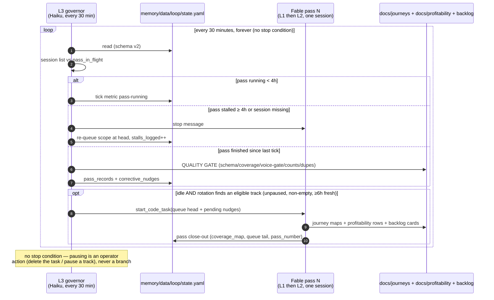
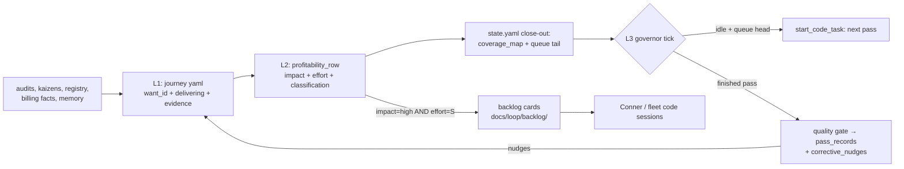

# Customer-journey + profitability loop with governor — system design

**Status:** v3, 2026-07-03 — **non-stop, 9-track, design-for-profit**.
v2's Jul-7 stop rule is removed per Conner: the loop never stops —
**profitability is the objective every pass designs toward, not a stop
condition** ("design FOR profitable", not "run UNTIL profitable"). The
Jul-7 window close is a model-knob change (`pass_model`), not a stop. Every
pass must end with a declared deliverable — a design decision, a merge-ready
fix spec, or a specific action — never another analysis layer; the
governor's primary gate (`deliverable_ok`) marks deliverable-less passes as
`drift`. The two v2 workers (L1 journey, L2 profitability) are now tracks
4–5 of nine lenses — CEO strategic, chief-of-staff, product-owner-per-piece,
every-tab audit, agent audit, business-model iteration, vertical priority —
selected by a weighted 20-slot rotation with a 6h per-track freshness cap.
Track definitions + deliverable rule: `docs/loop/prompts/TRACKS.md`;
rotation mechanics: the L3 prompt; weights, objective, and model-switch
procedure: `RUNBOOK.md`. The v2 design below still describes the L1/L2
method, the governor split, and the failure-mode table accurately — read
"until Jul 7" as "forever" and "queue head" as "chosen track's queue head"
throughout. (v2 2026-07-02: continuous until Jul 7. v1: weekly cadence,
replaced same day.) Internal doc — model names allowed.
**Owner question this system answers, continuously:** *does the product
actually deliver what customers want, and can we deliver the missing parts
profitably?*

## Why this exists

The July 2026 audits (`docs/audits/full-audit-2026-07-02/`) and kaizen retros
(`docs/kaizen/2026-07-02/`) produced the best gap inventory the business has
ever had — and both are one-shot artifacts that start decaying the day they
merge. Separately, the fleet has repeatedly shipped features nobody asked for
while activation-blocking gaps (TaxDome/Karbon unconnectable, portal
0%-activatable, guarantee undercounting) sat unowned. This loop makes the gap
inventory a standing, customer-journey-shaped, profitability-ranked artifact.

**Why continuous, why now:** Fable is included in the MAX plan window until
**2026-07-07** (`reference_claude_fable_5_back_2026_06_28`), after which it
moves to usage credits. Marginal Fable cost is therefore ~$0 for the window —
the loop burns it back-to-back rather than metering itself weekly. **v3:**
when the window closes the loop does not stop — Conner switches `pass_model`
(or pauses the mapping tracks and keeps the strategic ones) per RUNBOOK §
Model switch; the loop itself has no stop condition at all.

## The architecture: two Fable workers, one Haiku conductor

| | L1 journey-mapper | L2 profitability lens | L3 governor |
|---|---|---|---|
| Model | `pass_model` (claude-fable-5 today) | `pass_model` (claude-fable-5 today) | claude-haiku-4-5, never escalates, never calls another model |
| Cadence | continuous: fired by governor as pass stage 1 | same session, stage 2 | every 30 min (~48 ticks/day) |
| Prompt | `docs/loop/prompts/L1-journey-mapper.md` | `.../L2-profitability-lens.md` | `.../L3-haiku-heartbeat.md` |
| Unit of work | the queue entry's vertical × persona cells (coverage) or existing maps (depth) | same scope's verticals; files backlog cards for high/S rows | one tick: reconcile → gate → fire |
| Writes | `docs/journeys/` | `docs/profitability/`, `docs/loop/backlog/`, state close-out | state.yaml ticks/gates/nudges; one WORKING_STATE pause note |

**Passes never self-chain.** Every pass is fired by the governor; the
governor never writes content. That split is load-bearing: the expensive
model does all the judgment, the cheap model does all the process control,
and neither can silently take over the other's job.

## Queue algorithm (coverage-greedy, then depth)

State: `coverage_map` (one cell per vertical × persona in loop scope:
real-estate, cpa, law, property-management, general) and `queue` (ordered
pass plans). The finishing L2 stage appends to the tail; the governor pops
the head. Algorithm the pass runs when extending the tail:

1. **Coverage first (greedy on biggest unmapped area).** While any cell has
   `depth: 0`: next entry = the largest unmapped area — a whole unmapped
   vertical beats a missing persona in a mapped vertical; tie-break by tier
   revenue (partner-tier verticals first), then alphabetically. Batch up to
   2 verticals or ~3 personas per pass so passes stay ~1–3h.
2. **Then depth (rotate).** When all cells have `depth ≥ 1`: next entry =
   `mode: depth` on the vertical with the highest `Σ open_gap_count / depth`
   (most open gaps per unit of attention). Tie-break: stalest `last_pass`.
   A depth pass re-verdicts shipped fixes, splits coarse wants, adds newly
   ratified personas, and tightens L2 rows.
3. **Saturation valve.** If a depth pass nets < 5 new-or-changed wants, the
   pass marks the cell saturated in its close-out note; when everything is
   saturated the queue is left empty and the governor idles cheaply — the
   correct end state before Jul 7 if the map outruns the product.

Seeded sequence (in `state.yaml`): pass 2 = law + property-management
(coverage) · pass 3 = general + deepen real-estate--individual-agent ·
pass 4 = deepen cpa. Pass 5+ computed by the algorithm.

## Data flow and contracts

Everything machine-read flows through `memory/data/loop/schema.yaml`
(schema_version 2):

Design decisions worth stating:

- **Want ids are the join key and are stable across passes.** Depth passes
  reuse ids; progress tracking is id-diffing, not text-diffing.
- **The yaml block is the contract; prose is commentary.** The governor never
  parses prose — its quality gate is mechanical (parse, count, grep, gate).
- **The governor is deliberately dumb.** All judgment lives in Fable passes.
  The governor filters, fires, times out, and files metrics; "if in doubt,
  defer" is load-bearing. Its one feedback channel is `corrective_nudges` —
  notes the NEXT Fable pass (which has judgment) must address, so quality
  problems are fixed by the smart layer, one pass late, rather than badly by
  the cheap layer immediately.
- **Passes commit docs-only, directly to main.** `docs/journeys/`,
  `docs/profitability/`, `docs/loop/backlog/`, `memory/data/loop/` are inert
  paths — never built, never customer-facing — and a ~2h PR cadence would
  deadlock on review. Voice-gate runs inside the pass; a bad pass is a
  `git revert` plus governor re-queue. The system's own prompts/schema/docs
  still change via reviewed PRs (like this one).
- **This slots into existing precedent:** the YAML data layer (PR #265),
  `memory/WORKING_STATE.md`, the dispatch session tooling the fleet already
  uses, and the
  weekly kaizen (which should read the newest maps as retro input).
- **Truth Wave applies internally too.** Every want carries a `signal` ref;
  `todo-real-signal` exists so gaps in our customer research surface as
  first-class gaps. The only persona research today is the JTBD tables in
  `lib/verticals/*/content.ts` — analyst-derived, not observed-customer —
  tracked as a standing want (`*.awareness.persona-research`).

## Constraint rules (ratified; encoded in the L2 rule_check block)

1. **No outbound runtime** — `project_no_outbound_architecture`: agents draft,
   the customer's system sends.
2. **BYO keys for integrations by default** — substance ratified in the
   memory-scale work (PR #298 era); the named memory slug
   `feedback_integrations_are_byo_key_by_default` does not exist as a file yet
   (consistent with the kaizen finding that briefed memories were never
   written) — writing it is a backlog card candidate.
3. **Degraded mode is a live experience** — prod Anthropic key paused is
   policy; every want verdict must hold under the degraded banner (PR #276).
   Named slug `feedback_prod_anthropic_key_paused_is_policy`: also missing on
   disk; substance confirmed in kaizen 7/10.
4. **Cost architecture** — Haiku triage → Sonnet/Opus on need, no polling,
   prompt caching (compose order: Logging(Budget(Sentinel(Caching(Anthropic)))),
   `lib/billing/budget.ts` seam). Named slug `feedback_ai_cost_architecture_rules`:
   missing on disk; substance in `project_llm_provider_compose_order` +
   `project_budget_seam_shared`. The loop itself obeys the same shape: Haiku
   governs, Fable works, nothing polls beyond the 30-min tick.
5. **Service partnership on top of Claude SBM, never a competitor** —
   `project_sbm_wrapper_positioning_2026_06_06`. Named slug
   `project_service_partnership_positioning`: missing; same substance.
6. **Model/vendor invisible on customer surfaces** — internal loop docs may
   name models; nothing the loop writes ships to a customer surface.

## Failure modes

| Failure | Detection | Blast radius | Recovery |
|---|---|---|---|
| Pass stalls or dies silently | governor STEP 1b/1c: ≥4h or session missing | ≤4h of lost window | stop + re-queue same scope; `stalls_logged` counts recurrences |
| Governor task itself dies (precedent: kaizen skipped 2026-06-28 unnoticed) | `last_tick_at` older than ~2h | passes stop being fired; nothing corrupts | re-enable the scheduled task; state reconciles on first tick |
| L1 hallucinates a "delivering: yes" | quality gate can't catch semantics — nudge channel + human skim of verdict diffs | worst failure — hides a gap | evidence rule (yes requires an opened code path); depth passes re-verdict |
| Pass emits schema-broken or off-scope output | governor quality gate (parse/coverage/count/dupes) | one wasted pass | `rejected` verdict → scope re-queued at head with a nudge |
| Duplicate wants across passes | gate check 5 greps new ids vs old maps | map noise | nudge; depth pass merges |
| Two passes racing | STEP 1 reconciliation + one-governor rule | a state.yaml push race | loser re-gated from its files; docs-only so no data loss |
| Runaway pass (>100k output tokens) | RUNBOOK sanity caps | one pass | kill session; governor re-queues |
| Schema drift | governor refuses on unknown schema_version | one skipped tick chain | bump schema + prompts in one PR |
| Loop edits something it shouldn't | pass allowed-paths rule + governor allowed-files rule; CI gates | none if respected | git revert |
| Jul 7 window closes with no model decision | RUNBOOK § Model switch: passes keep firing on Fable at usage-credit rates | spend, not correctness — a deliberate-by-default trap | Conner sets `pass_model` (or pauses tracks 4–9); the CoS track surfaces the open decision |
| Pass drifts into analysis-for-its-own-sake | governor's primary gate: `last_pass_deliverables` empty or unresolvable → verdict `drift` | one wasted pass, no compounding analysis layers | corrective nudge to the track; repeated drift ⇒ fix TRACKS.md via reviewed PR |

## Cost projection

Full math in `docs/loop/RUNBOOK.md`:

- **L1+L2 passes through 2026-07-06: ~$0 marginal** (plan-included window —
  the design premise). Token-equivalent value: ~$4–6 per pass at Fable card
  rates; ~10 passes/day ≈ $40–60/day of included-value burned deliberately.
- **Governor:** 48 Haiku ticks/day, each tiny → well under $1/day.
- **After Jul 7:** loop stops; options priced in RUNBOOK (on-demand, or Opus
  4.8 continuous at ~$25–40/day — only if the fleet consumes cards that fast).

## Pass-1 seed (this PR)

L1+L2 run end-to-end for **real-estate** (broker-owner, individual-agent) and
**cpa** (partner-owner, staff-accountant) — the four personas with the
strongest real signal (ratified JTBD tables in `lib/verticals/*/content.ts`,
the 2026-07-02 audits, kaizen retros). CPA's remaining three JTBD roles are
queued for the pass-4 depth pass. Outputs: `docs/journeys/2026-07-02/`,
`docs/profitability/2026-07-02/`. The seed validated the schema and forced
one v1 change (`also_covers` on profitability rows); the v2 bump adds the
continuous-loop state (queue, coverage_map, nudges, ticks). Want volume
landed at 18–31 per persona — invited-seat personas run under the 20-want
floor by design (their buying stages belong to the buyer persona).
