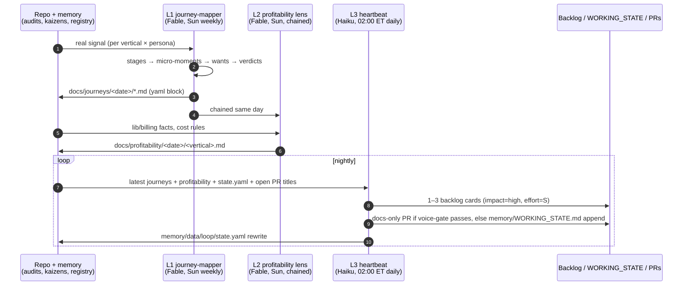
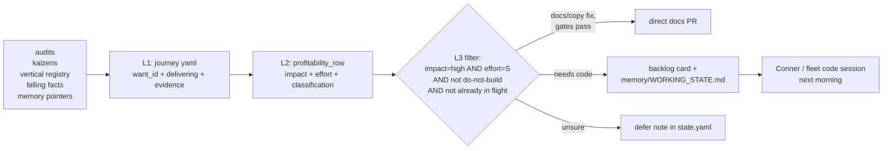

# Customer-journey + profitability + heartbeat loop — system design

**Status:** v1, 2026-07-02. Internal doc — model names allowed here.
**Owner question this system answers, continuously:** *does the product
actually deliver what customers want, and can we deliver the missing parts
profitably?*

## Why this exists

The July 2026 audits (`docs/audits/full-audit-2026-07-02/`) and kaizen retros
(`docs/kaizen/2026-07-02/`) produced the best gap inventory the business has
ever had — and both are one-shot artifacts that start decaying the day they
merge. Separately, the fleet has repeatedly shipped features nobody asked for
while activation-blocking gaps (TaxDome/Karbon unconnectable, portal
0%-activatable, guarantee undercounting) sat unowned. This loop makes the gap
inventory a standing, customer-journey-shaped, profitability-ranked artifact
that a cheap nightly process can act on.

## Three layers

| | L1 | L2 | L3 |
|---|---|---|---|
| Model | claude-fable-5 | claude-fable-5 | claude-haiku-4-5 (never escalates) |
| Prompt | `docs/loop/prompts/L1-journey-mapper.md` | `.../L2-profitability-lens.md` | `.../L3-haiku-heartbeat.md` |
| Unit of work | one vertical × persona map | one vertical | one night, ≤3 picks |
| Output | `docs/journeys/<date>/` | `docs/profitability/<date>/` | `docs/loop/backlog/`, `memory/WORKING_STATE.md`, `memory/data/loop/state.yaml`, occasional `loop/*` docs PRs |

## Data flow and contracts

Everything machine-read flows through the versioned schema at
`memory/data/loop/schema.yaml` (schema_version 1):

Design decisions worth stating:

- **Want ids are the join key and are stable across weeks.** L1 must reuse ids
  from the prior week's map; downstream progress tracking (did a gap close?) is
  id-diffing, not text-diffing.
- **The yaml block inside each markdown file is the contract; prose is
  commentary.** L3 never parses prose. This keeps Haiku's job mechanical.
- **L3 is deliberately dumb.** All judgment (what's a want, what's it worth)
  happens weekly in Fable. The nightly layer only filters, copies, and files.
  The "if in doubt, defer" rule is load-bearing: a wrong nightly PR costs
  reviewer trust; a deferred one costs nothing.
- **This slots into existing precedent, not beside it:** the YAML data layer
  (PR #265, `lib/memory/data-readers.ts`), `memory/WORKING_STATE.md` (currently
  an unfilled template — this loop becomes its first real writer via the
  `Loop backlog` section), and the weekly-kaizen scheduled task (Sun 9am ET).
  L1/L2 should run before kaizen on Sundays so kaizen can consume fresh maps.
- **Truth Wave applies internally too.** Every want carries a `signal` ref;
  `todo-real-signal` is an allowed value precisely so gaps in our customer
  research surface as first-class gaps instead of being papered over with
  invented personas. Today the only persona research is the JTBD tables in
  `lib/verticals/*/content.ts` — analyst-derived, not observed-customer. The
  loop tracks that as a standing want (`*.awareness.persona-research`).

## Constraint rules (ratified; encoded in the L2 rule_check block)

1. **No outbound runtime** — `project_no_outbound_architecture`: agents draft,
   the customer's system sends.
2. **BYO keys for integrations by default** — substance ratified in the
   memory-scale work (PR #298 era); the named memory slug
   `feedback_integrations_are_byo_key_by_default` does not exist as a file yet
   (consistent with the kaizen finding that briefed memories were never
   written) — writing it is a backlog card candidate.
3. **Degraded mode is a live experience** — prod Anthropic key paused is
   policy; every want verdict must hold under the degraded banner (PR #276).
   Named slug `feedback_prod_anthropic_key_paused_is_policy`: also missing on
   disk; substance confirmed in kaizen 7/10.
4. **Cost architecture** — Haiku triage → Sonnet/Opus on need, no polling,
   prompt caching (compose order: Logging(Budget(Sentinel(Caching(Anthropic)))),
   `lib/billing/budget.ts` seam). Named slug `feedback_ai_cost_architecture_rules`:
   missing on disk; substance in `project_llm_provider_compose_order` +
   `project_budget_seam_shared`.
5. **Service partnership on top of Claude SBM, never a competitor** —
   `project_sbm_wrapper_positioning_2026_06_06`. Named slug
   `project_service_partnership_positioning`: missing; same substance.
6. **Model/vendor invisible on customer surfaces** — internal loop docs may
   name models; nothing L3 ships to a customer surface may.

## Failure modes

| Failure | Detection | Blast radius | Recovery |
|---|---|---|---|
| L1 skips a Sunday (scheduler gap — precedent: kaizen silently skipped 2026-06-28) | L3 reads run_date; `consecutive_empty_runs` ≥7 flags staleness in memory/WORKING_STATE.md | L3 works off stale maps — degraded, not wrong | run L1 manually per RUNBOOK |
| L1 hallucinates a "delivering: yes" | L2/human spot-check: yes requires a code path opened this run | worst failure — hides a gap for a week | verdict evidence rule + weekly human skim of verdict diffs |
| L2 misclassifies do-not-build | reviewed in the weekly PR like any doc | a good idea sleeps until next week | edit the row, re-run L3 next night |
| L3 opens a bad docs PR | ready-for-review, never auto-merge; voice-gate/brand-gate in CI | one reviewer-minute | close PR; card stays for a human |
| L3 spams duplicate cards | dedup vs open PR titles + existing backlog cards, keyed on want_id | noise in docs/loop/backlog | cards carry status; mark rejected |
| Schema drift breaks Haiku parsing | L3 refuses on unknown schema_version and defers | one skipped night | bump schema + prompts in one PR |
| Runaway cost | fixed inputs per prompt; RUNBOOK per-run caps ($5/map, $0.25/night) | bounded by cadence — no retries, no polling | kill switch level 1 (pause schedules) |
| Loop edits something it shouldn't | L3 hard rule: docs/, memory/data/loop/, memory/WORKING_STATE.md only; never runtime code, facts.ts, brand assets | none if respected; CI gates back it up | git revert |

## Cost projection

Full math in `docs/loop/RUNBOOK.md`. Summary at current pricing (Fable $10/$50
per MTok, Haiku $1/$5, cache reads ~0.1×):

- L1 weekly (≈7 maps): **~$18–23**
- L2 weekly (5 verticals): **~$8–11**
- L3 nightly: **~$0.05–0.10** (~$2–3/month)
- **System: ~$120–160/month.** For calibration: one avoided wrong-feature wave
  (multi-session Fable fleet work) costs more than a quarter of this loop.

## Pass-1 seed (this PR)

L1+L2 run end-to-end for **real-estate** (personas: broker-owner,
individual-agent) and **cpa** (personas: partner-owner, staff-accountant) —
the four personas with the strongest real signal (ratified JTBD tables in
`lib/verticals/*/content.ts`, the 2026-07-02 audits, and kaizen retros). CPA's
remaining three JTBD roles (audit senior, client-services manager, admin) are
deferred to the first scheduled run and tracked in the maps as scoping notes.
Outputs: `docs/journeys/2026-07-02/`, `docs/profitability/2026-07-02/`. The
seed validated the schema and forced exactly one change: `also_covers` was
added to `profitability_row` so one fix covering several wants (e.g. the
approval-loop cluster) yields one row instead of duplicate nightly cards.
Want volume landed at 18–31 per persona — the two invited-seat personas came
in just under the 20-want floor, which is expected for personas whose buying
stages belong to someone else; the floor applies to buyer personas.
